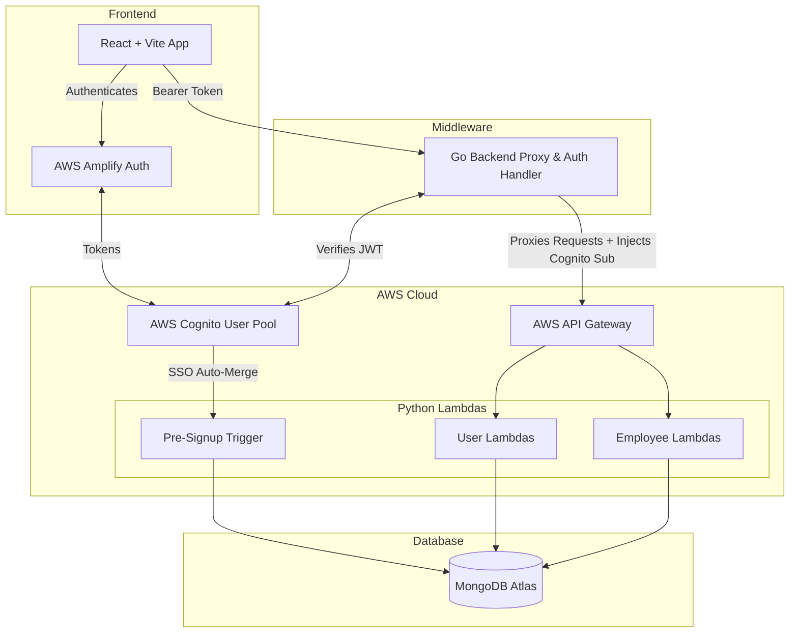

# 🏢 Employee Management System (EMS)

A full-stack, serverless-ready Employee Management System built with a robust, multi-tier architecture. It provides secure authentication, seamless single-sign-on (SSO), and isolated tenant data management for employees.

---

## 📋 Table of Contents
- [Architecture Overview](#%EF%B8%8F-architecture-overview)
- [Key Features](#-key-features)
- [Prerequisites](#-prerequisites)
- [Environment Configuration](#%EF%B8%8F-environment-configuration)
- [Project Structure](#%EF%B8%8F-project-structure)
- [API Endpoints](#-api-endpoints-go-middleware)
- [Security & Authentication Flow](#-security--authentication-flow)
- [Local Setup & Development](#-local-setup--development)

---

## 🏗️ Architecture Overview

The application follows a modern cloud-native architecture utilizing **React**, **Go**, **Python**, and **AWS**:



### 1. Frontend (`frontend_awsamplify`)
A responsive **React** application built with Vite and Tailwind CSS. It uses **AWS Amplify** for handling user authentication via AWS Cognito (including Google SSO).
*   **Key Components:** `Dashboard`, `EmployeeTable`, `EmployeeModal`, `SearchBar`.

### 2. Go Backend Middleware (`backend`)
Acts as a secure proxy and authentication middleware written in **Go**.
*   Intercepts frontend requests and cryptographically verifies Cognito JWTs via JWKS.
*   Extracts the unique Cognito `sub` (Subject ID) from the token and injects it into the request context.
*   Proxies validated requests to the AWS API Gateway, enforcing tenant isolation by appending the `created_by` attribute.

### 3. Python Serverless Backend (`LambdaPython`)
The core business logic implemented as **AWS Lambda** functions using **Python** and **Pydantic**.
*   **Users:** Manages user creation (`create_user.py`), fetching (`get_user.py`), and a critical `pre_signup.py` Cognito trigger that automatically merges Google SSO logins with existing native email accounts.
*   **Employees:** Handles CRUD operations and search (`create_employee.py`, `get_employees.py`, etc.).
*   **Validation:** Strict data validation using `Pydantic` models before database interaction.

### 4. Database
**MongoDB Atlas** serves as the primary data store. Tenant isolation is enforced natively by querying employees strictly via the `created_by` index (Cognito `sub`).

---

## ✨ Key Features

*   **Secure Authentication**: Standard email/password login and Google SSO powered by AWS Cognito.
*   **Smart Account Linking**: AWS Cognito Pre-Sign-Up Lambda trigger automatically merges Google SSO identities with existing native accounts to prevent duplicates.
*   **Tenant Data Isolation**: Users can only view, edit, and delete employees they have created. The Go backend natively enforces this.
*   **Employee Management**: Full CRUD capabilities with real-time search functionality.
*   **Data Validation**: Dual-layer validation (React frontend + Pydantic backend models).

---

## 🛠 Prerequisites

Before running this project, ensure you have the following installed:
*   **Go** (1.20 or higher)
*   **Node.js** (v18 or higher) & **npm**
*   **Python** (3.9 or higher) & **pip**
*   **AWS CLI** (Configured with appropriate IAM permissions)
*   **MongoDB Atlas** (Cluster URI)

---

## ⚙️ Environment Configuration

You will need to configure `.env` files in multiple directories to connect the services.

### Go Backend (`backend/.env`)
```env
APP_ENV=development
APP_PORT=8080
COGNITO_CLIENT_ID=your_cognito_client_id
COGNITO_OPENID_CONFIG_URL=https://cognito-idp.<region>.amazonaws.com/<user_pool_id>
FRONTEND_URL=http://localhost:5173
API_GATEWAY_BASE_URL=https://<api_id>.execute-api.<region>.amazonaws.com/dev
```

### Python Lambda (`LambdaPython/.env` for local testing)
```env
MONGODB_URI=mongodb+srv://<username>:<password>@cluster.mongodb.net/
```

### React Frontend (`frontend_awsamplify/.env` or Amplify config)
Ensure your `main.jsx` Amplify configuration includes your User Pool ID, App Client ID, and OAuth domain.

---

## 🗂️ Project Structure

```text
EMS/
├── backend/                  # Go Middleware / Proxy
│   ├── internal/
│   │   ├── apigateway/       # HTTP Client for AWS API Gateway
│   │   ├── cognito/          # JWT Verification Logic
│   │   ├── handler/          # Route Handlers (Auth & Employees)
│   │   ├── middleware/       # JWT Auth Middleware
│   │   ├── model/            # Go Structs & Payloads
│   │   └── utils/            # Payload enrichment (injecting sub)
│   └── main.go               # Go Entrypoint
│
├── frontend_awsamplify/      # React App
│   ├── src/
│   │   ├── components/       # Reusable UI (Modals, Tables, Toasts)
│   │   ├── pages/            # Main Dashboard Views
│   │   ├── App.jsx           # App Router & Layout
│   │   └── main.jsx          # AWS Amplify Config & Initialization
│   └── package.json
│
└── LambdaPython/             # Python AWS Lambdas
    ├── db/                   # MongoDB connection logic
    ├── lambdas/
    │   ├── employees/        # Employee CRUD functions
    │   └── users/            # User creation, fetching, and Pre-Signup trigger
    ├── models/               # Pydantic schemas (user.py, employee.py)
    ├── utils/                # Response handlers
    └── requirements.txt      # Lambda dependencies (pymongo, pydantic, boto3)
```

---

## 📡 API Endpoints (Go Middleware)

All endpoints require an `Authorization: Bearer <access_token>` header except where noted.

### Auth
*   **`GET /api/me`**
    *   **Action**: Fetches the logged-in user profile. If the user doesn't exist in MongoDB but has a valid Cognito ID token (`X-Id-Token`), it provisions the user.

### Employees
*   **`GET /api/employees`**
    *   **Action**: Retrieves all employees belonging to the authenticated user.
*   **`POST /api/employees`**
    *   **Action**: Creates a new employee.
*   **`GET /api/employees/search?query=...`**
    *   **Action**: Searches the user's employees by name, email, or position.
*   **`PATCH /api/employees/{empId}`**
    *   **Action**: Updates an existing employee.
*   **`DELETE /api/employees/{empId}`**
    *   **Action**: Deletes an employee by ID.

---

## 🔒 Security & Authentication Flow

1. **Login**: User authenticates via AWS Amplify (Standard or Google SSO).
2. **Token Generation**: AWS Cognito returns a JWT Access Token and ID Token to the frontend.
3. **API Request**: Frontend attaches the Access Token as a `Bearer` token to Go API requests.
4. **Verification**: Go Middleware intercepts the request, downloads the JWKS from Cognito, and cryptographically verifies the token signature and expiration.
5. **Tenant Injection**: Go extracts the verified `sub` (Cognito UUID) and embeds it securely into the payload as `created_by`. **The frontend cannot spoof this field.**
6. **Execution**: Python Lambdas receive the trusted `created_by` field and use it to safely filter/insert records in MongoDB.

---

## 🚀 Local Setup & Development

### 1. Start the Go Backend
1. Navigate to the Go backend directory:
   ```bash
   cd backend
   ```
2. Run the server:
   ```bash
   go run main.go
   ```
   *The server runs on port `8080` by default.*

### 2. Start the React Frontend
1. Navigate to the frontend directory:
   ```bash
   cd frontend_awsamplify
   ```
2. Install dependencies:
   ```bash
   npm install
   ```
3. Run the Vite development server:
   ```bash
   npm run dev
   ```

### 3. Deploying Python Lambdas
1. Ensure your `LambdaPython/requirements.txt` dependencies are installed or packaged.
2. Deploy the functions to AWS API Gateway/Lambda using your preferred IaC tool (AWS SAM, Serverless Framework, or AWS Console).
3. Ensure the `pre_signup.py` Lambda is attached to your AWS Cognito User Pool as a **Pre sign-up trigger**.
